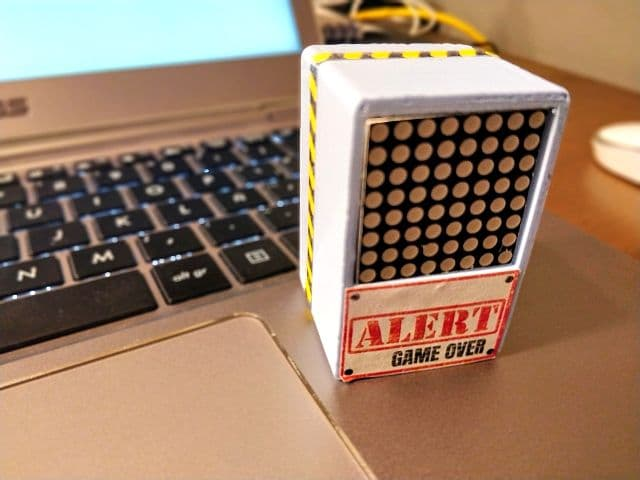
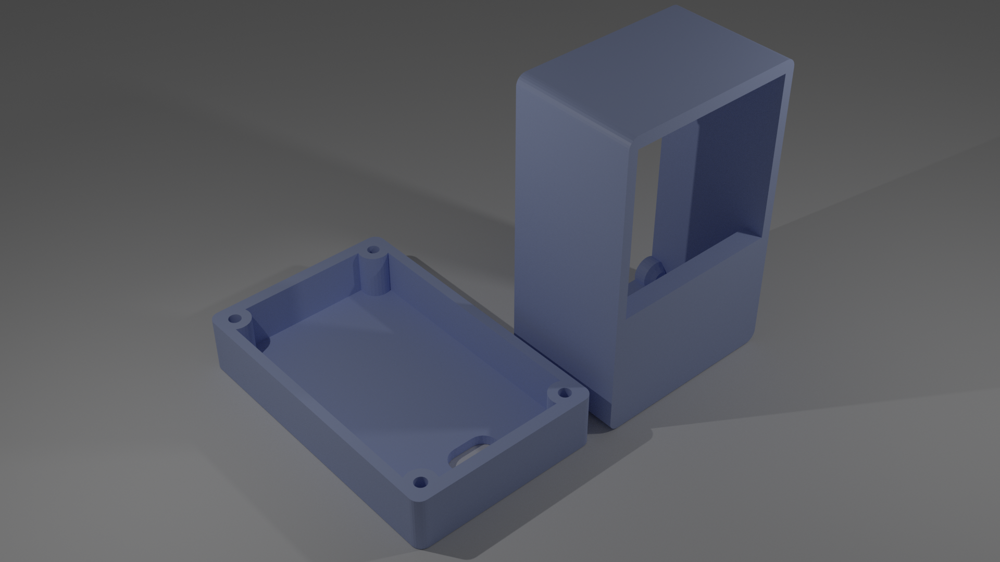
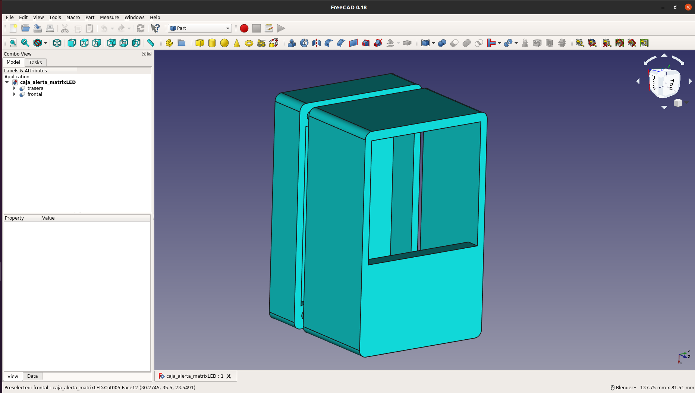

# esp8266 ALERT BOX
Sistema de alerta visual y controlado remotamente.

En mi blog puedes encontrar algo mas de info: https://akirasan.net/alert-box/

## Requisitos:
- Servidor MQTT (Mosquitto, por ejemplo)
- Servidor Node-RED (es opcional, pero ideal para controlar mensajes por MQTT)

## Conexiones:

## Decoración:

Para decorar la ALERT_BOX se puede imprimir un diseño, recortar y pegar:

## Diseño 3D

Un render de los ficheros STLs:

Diseñado mediante FreeCAD. El fichero fuente para su modificación está disponible. Así cómo los ficheros STL.

Por útimo aquí os dejo un vídeo demo:

https://www.youtube.com/watch?v=pHf0P_Nk2_A
